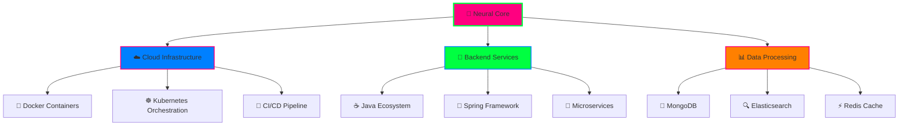

# 🚀 Welcome to Pavan's Digital Universe

<!-- HOLOGRAPHIC MATRIX ENTRANCE -->

  

<!-- CYBERPUNK AVATAR SECTION -->

  
  
   
  
  
  
    
  
  
  
  
   
  
  
  
  
  

<!-- GLITCH EFFECT MANIFESTO -->

  

<!-- NEON TECH STACK HOLOGRAM -->

  

 

<!-- ANIMATED SKILL MATRIX -->

<!-- CYBERPUNK STATS DISPLAY -->

  

 

  

<!-- HOLOGRAPHIC CONTRIBUTION MATRIX -->

  

 

<!-- QUANTUM CONTRIBUTION SNAKE -->

  

 

<picture>
  <source media="(prefers-color-scheme: dark)" srcset="https://raw.githubusercontent.com/pavan-png/pavan-png/output/github-contribution-grid-snake-dark.svg">
  <source media="(prefers-color-scheme: light)" srcset="https://raw.githubusercontent.com/pavan-png/pavan-png/output/github-contribution-grid-snake.svg">
  
</picture>

<!-- ADVANCED METRICS DASHBOARD -->

  

  

<!-- AI-POWERED QUOTE MATRIX -->

  

 

  

<!-- NEURAL NETWORK ARCHITECTURE -->

<!-- DIGITAL CONSCIOUSNESS METER -->

  

 

<!-- QUANTUM FOOTER PORTAL -->

  

 

<!-- Quantum Contact Matrix -->

  

<!-- MATRIX EXIT PORTAL -->

  

 

**`💀 "In the Matrix of Code, We Are All Neo" 💀`**

---

  🌌 <strong>Crafted in the Digital Dimension by Pavan Kumar</strong> 🌌 
  ⚡ <em>Where Code Meets Consciousness</em> ⚡

